#### Диплом DevOps Нетология

## Общее описание:

В рамках разработки реализовано:

1. Автоматическое развертывание 5-ти виртуальных машин, объектного хранилища, кластера БД из двух нод в Яндекс облаке, посредством Terraform. Вручную регистрировались: folder и сервисный аккаунт. Для возможности выделения dev от prod и остальных Workspace - созданы отдельные dev - prod - stage, где хранятся State.

2. 5 виртуальных машин разработано для сервисов, указаны ниже - одна из них, с особенным образои NAT, для организации Reverse Proxy. Фактически данная машина, так же может выполнять роль Bastion. Автоматизирован поцесс сборки и выгрузки конфигураций NGINX.

3. Используя возможости Packer, разработаны соответстующие образы (2-х типов), в которые зашиты необходимые "слои".

4. На разметке Yml и Ansible автоматизирован процесс получения сертификатов как с помощью Letsencrypt (NBD: необходимо разделить по времени инсталляции pubkey и fullchain в конфиг виртуальной машины, на которой развернуты сразу три сервиса - prometheus, grafana, altermanager), и с помощью Openssl для инвалидных сертификатов и ключей для обмена данными сервисов между собой.

5. Разработаны роли nginx_role, node_exporter_role, promgrafal_role, wordpress_role для Ansible playbook - deploy, соответственно, балансировщика и веб-серверов, экспортеров prometheus, стека мониторинга (alertmanager, prometheus, grafana), wordpress.

Автоматизированная установка на выходе разворачивает следующие сервисы:

1. [grafana.link-tel.ru](https://grafana.link-tel.ru) Grafana
2. [prometheus.link-tel.ru](https://prometheus.link-tel.ru) Prometheus
3. [alertmanager.link-tel.ru](https://alertmanager.link-tel.ru) Alertmanager - в том числе предшествующие 2, мониторинг и оповещение.
4. [gitlab.link-tel.ru](https://gitlab.link-tel.ru) Gitlab - Фреймворк CI/СD.
5. [www.link-tel.ru](https://www.link-tel.ru/wp-login.php) Wordpress - имитация кода и данных в prod и dev разработчиков.

Сервисы 1,2,3 развернуты на monitoring.link-tel.ru
4 - gitlab.link-tel.ru и runner.link-tel.ru
5 - app.link-tel.ru

Отдельная ВМ с образом NAT выполняет функции Reverse proxy на Nginx, с использованием проксирования https соединений.

Так же автоматизирован способ получения CA сертификатов для доступа по https, как валидных - для публичного доступа, так и инвалидных - для авторизаии сервисов между собой по https.

## Панель развернутых сервисов в Яндекс Облако:

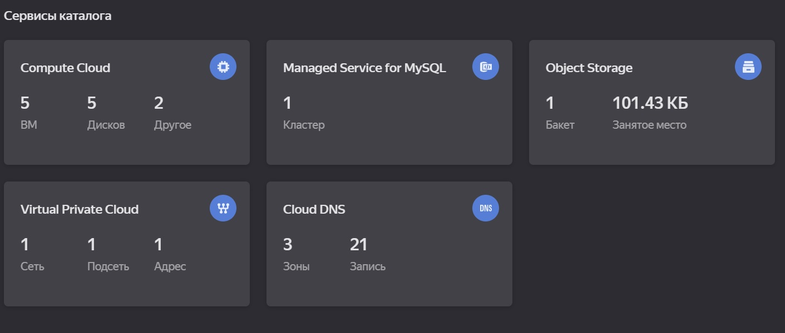

## Скриншоты сервисов:

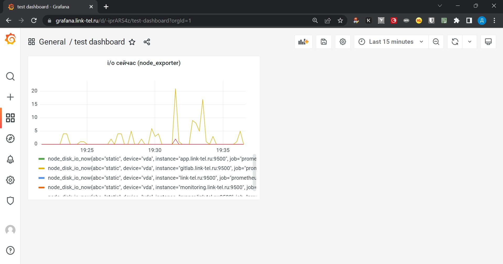

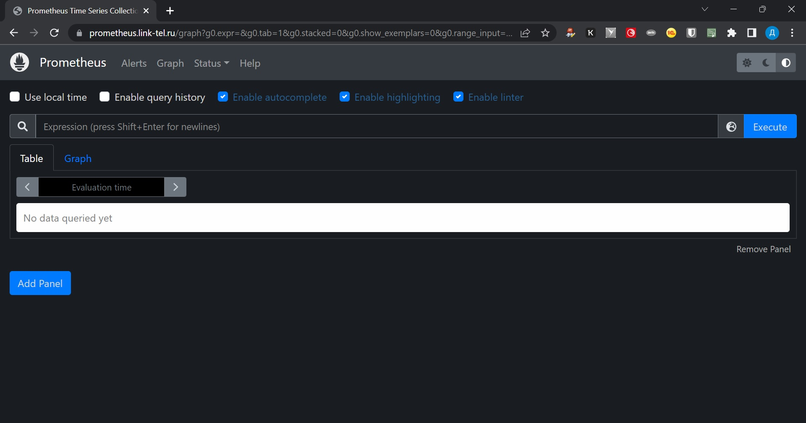

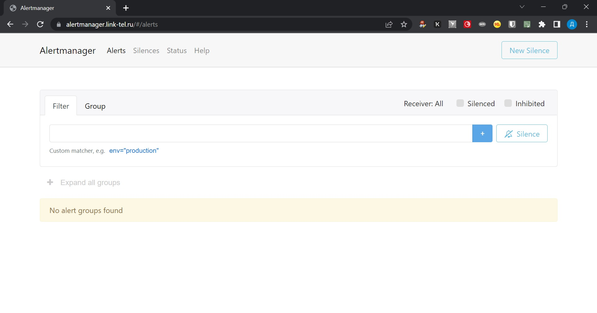

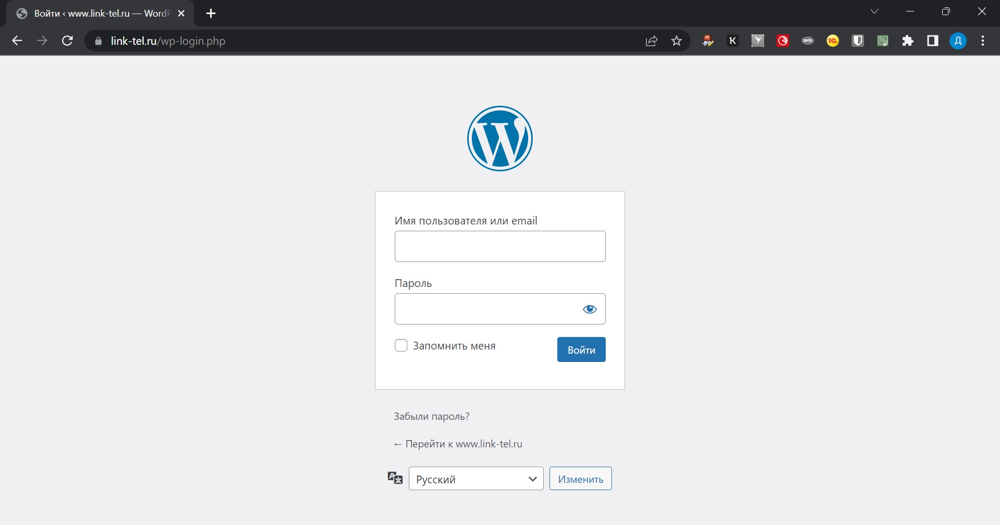

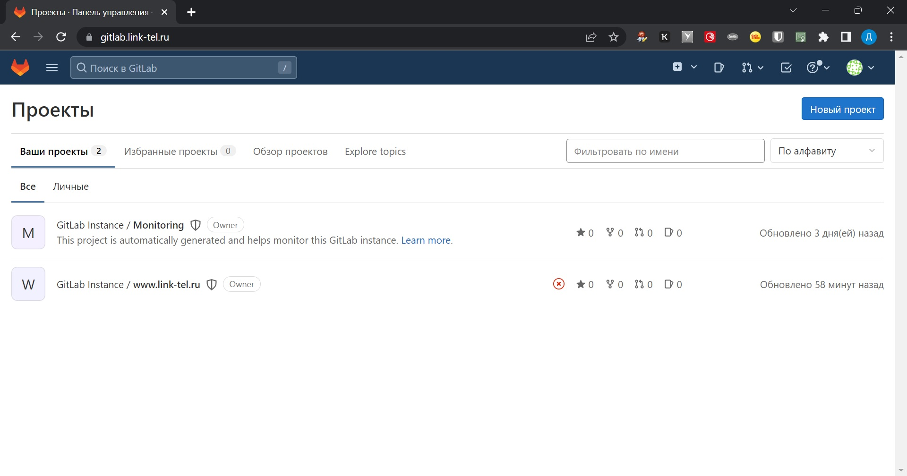

## Подробнее о Terraform

Все sensitive спрятаны, и критичные данные убраны в переменные окружения ОС.
Созданные image в Packer использованы для deploy ресурсов. В коде, для удобства, сокращения и читаемости, использованы структуры типа карта карт списка строк:

`
variable "my_subnets" {
  description = "my zones & my subnets"
  type        = map(map(list(string)))
  default = {
    a = { 
          ru_central1_a = ["192.168.111.0/24",]
        }
    b = { 
          ru_central1_b = ["192.168.112.0/24",]
        }
    c = { 
          ru_central1_c = ["192.168.110.0/24",]
        }
  }
}

`

Для возможности дополнительного контроля, добавлена серийная консоль на машину runner.link-tel.ru, возможно управлять с нее (для случаев потери ssh доступа), что видно в terraform plan:

`
root@dev1-10:~/netol_do/diplom/terraform# terraform plan
data.yandex_iam_service_account.sa: Reading...
data.yandex_vpc_address.addr: Reading...
data.yandex_vpc_network.network_dpl: Reading...
data.yandex_vpc_subnet.subnets_dpl_ru_central1_a: Reading...
data.yandex_iam_service_account.sa: Read complete after 0s [id=ajeei942vm1rejr9fkmo]
yandex_iam_service_account_static_access_key.sa-static-key: Refreshing state... [id=aje4m1vlil2vsi3nkkor]
yandex_resourcemanager_folder_iam_member.sa-editor: Refreshing state... [id=b1g0cjulnkupf6ghdlko/storage.editor/serviceAccount:ajeei942vm1rejr9fkmo]
data.yandex_vpc_subnet.subnets_dpl_ru_central1_a: Read complete after 0s [id=e9b7rghfllllpm1l79gf]
data.yandex_vpc_address.addr: Read complete after 1s [id=e9bf0ss5kmnabpf25nm2]
yandex_compute_instance.wwwlinktelru: Refreshing state... [id=fhmhjhj4g3gfg86bluqn]
yandex_compute_instance.runlinktel: Refreshing state... [id=fhm8ndfrkegdmktt9fvr]
yandex_compute_instance.monlinktel: Refreshing state... [id=fhmmfpg7g20glpv5ne48]
yandex_compute_instance.linktelru: Refreshing state... [id=fhmt1nn9l390488u7ddg]
yandex_compute_instance.gitlablinktel: Refreshing state... [id=fhmn9f363rq83gj8rgs4]
data.yandex_vpc_network.network_dpl: Read complete after 1s [id=enp7qsbiu0ocldui5ttj]
yandex_vpc_security_group.mysql-sg: Refreshing state... [id=enpi9qu7fgg2pmhcl0du]
yandex_vpc_security_group.my-sg: Refreshing state... [id=enpnerrn0h16uvdsm44t]
yandex_mdb_mysql_cluster.db_cluster: Refreshing state... [id=c9qndkrctkp2kdffec92]
yandex_mdb_mysql_database.db_wordpress: Refreshing state... [id=c9qndkrctkp2kdffec92:wordpress]
yandex_mdb_mysql_user.wordpress: Refreshing state... [id=c9qndkrctkp2kdffec92:wordpress]

Terraform used the selected providers to generate the following execution plan. Resource actions are indicated with the following
symbols:
  ~ update in-place

Terraform will perform the following actions:

  # yandex_compute_instance.runlinktel will be updated in-place
  ~ resource "yandex_compute_instance" "runlinktel" {
        id                        = "fhm8ndfrkegdmktt9fvr"
      ~ metadata                  = {
          - "serial-port-enable" = "1" -> null
            # (1 unchanged element hidden)
        }
        name                      = "runlinktel"
        # (11 unchanged attributes hidden)

        # (5 unchanged blocks hidden)
    }

Plan: 0 to add, 1 to change, 0 to destroy.

──────────────────────────────────────────────────────────────────────────────────────────────────────────────────────────────────────

Note: You didn't use the -out option to save this plan, so Terraform can't guarantee to take exactly these actions if you run
"terraform apply" now.
root@dev1-10:~/netol_do/diplom/terraform# terraform apply -auto-approve
data.yandex_vpc_network.network_dpl: Reading...
data.yandex_vpc_subnet.subnets_dpl_ru_central1_a: Reading...
data.yandex_vpc_address.addr: Reading...
data.yandex_iam_service_account.sa: Reading...
data.yandex_vpc_address.addr: Read complete after 1s [id=e9bf0ss5kmnabpf25nm2]
data.yandex_vpc_subnet.subnets_dpl_ru_central1_a: Read complete after 1s [id=e9b7rghfllllpm1l79gf]
yandex_compute_instance.wwwlinktelru: Refreshing state... [id=fhmhjhj4g3gfg86bluqn]
yandex_compute_instance.monlinktel: Refreshing state... [id=fhmmfpg7g20glpv5ne48]
yandex_compute_instance.linktelru: Refreshing state... [id=fhmt1nn9l390488u7ddg]
yandex_compute_instance.runlinktel: Refreshing state... [id=fhm8ndfrkegdmktt9fvr]
yandex_compute_instance.gitlablinktel: Refreshing state... [id=fhmn9f363rq83gj8rgs4]
data.yandex_iam_service_account.sa: Read complete after 1s [id=ajeei942vm1rejr9fkmo]
yandex_resourcemanager_folder_iam_member.sa-editor: Refreshing state... [id=b1g0cjulnkupf6ghdlko/storage.editor/serviceAccount:ajeei942vm1rejr9fkmo]
yandex_iam_service_account_static_access_key.sa-static-key: Refreshing state... [id=aje4m1vlil2vsi3nkkor]
data.yandex_vpc_network.network_dpl: Read complete after 1s [id=enp7qsbiu0ocldui5ttj]
yandex_vpc_security_group.my-sg: Refreshing state... [id=enpnerrn0h16uvdsm44t]
yandex_vpc_security_group.mysql-sg: Refreshing state... [id=enpi9qu7fgg2pmhcl0du]
yandex_mdb_mysql_cluster.db_cluster: Refreshing state... [id=c9qndkrctkp2kdffec92]
yandex_mdb_mysql_database.db_wordpress: Refreshing state... [id=c9qndkrctkp2kdffec92:wordpress]
yandex_mdb_mysql_user.wordpress: Refreshing state... [id=c9qndkrctkp2kdffec92:wordpress]

Terraform used the selected providers to generate the following execution plan. Resource actions are indicated with the following
symbols:
  ~ update in-place

Terraform will perform the following actions:

  # yandex_compute_instance.runlinktel will be updated in-place
  ~ resource "yandex_compute_instance" "runlinktel" {
        id                        = "fhm8ndfrkegdmktt9fvr"
      ~ metadata                  = {
          - "serial-port-enable" = "1" -> null
            # (1 unchanged element hidden)
        }
        name                      = "runlinktel"
        # (11 unchanged attributes hidden)

        # (5 unchanged blocks hidden)
    }

Plan: 0 to add, 1 to change, 0 to destroy.
yandex_compute_instance.runlinktel: Modifying... [id=fhm8ndfrkegdmktt9fvr]
yandex_compute_instance.runlinktel: Modifications complete after 6s [id=fhm8ndfrkegdmktt9fvr]

Apply complete! Resources: 0 added, 1 changed, 0 destroyed.

Outputs:

TF_VAR_subnets_dpl_ru_central1_a = {
  "created_at" = "2022-09-19T14:40:01Z"
  "description" = ""
  "dhcp_options" = tolist([])
  "folder_id" = "b1g0cjulnkupf6ghdlko"
  "id" = "e9b7rghfllllpm1l79gf"
  "labels" = tomap({})
  "name" = "subnet_dpl_192.168.111.0/24"
  "network_id" = "enp7qsbiu0ocldui5ttj"
  "route_table_id" = "enpsdumn61p71aktehc6"
  "subnet_id" = "e9b7rghfllllpm1l79gf"
  "v4_cidr_blocks" = tolist([
    "192.168.111.0/24",
  ])
  "v6_cidr_blocks" = tolist([])
  "zone" = "ru-central1-a"
}
TF_VAR_subnets_dpl_ru_central1_a_id = "e9b7rghfllllpm1l79gf"
external_ipv4_address = {
  "address_id" = "e9bf0ss5kmnabpf25nm2"
  "created_at" = "2022-09-19T14:40:00Z"
  "description" = ""
  "external_ipv4_address" = tolist([
    {
      "address" = "51.250.50.9"
      "ddos_protection_provider" = "qrator"
      "outgoing_smtp_capability" = ""
      "zone_id" = "ru-central1-a"
    },
  ])
  "folder_id" = "b1g0cjulnkupf6ghdlko"
  "id" = "e9bf0ss5kmnabpf25nm2"
  "labels" = tomap({})
  "name" = "pub_ipv4"
  "reserved" = true
  "used" = true
}
my_subnets = tomap({
  "a" = tomap({
    "ru_central1_a" = tolist([
      "192.168.111.0/24",
    ])
  })
  "b" = tomap({
    "ru_central1_b" = tolist([
      "192.168.112.0/24",
    ])
  })
  "c" = tomap({
    "ru_central1_c" = tolist([
      "192.168.110.0/24",
    ])
  })
})
network_dpl = {
  "created_at" = "2022-09-19T14:40:01Z"
  "default_security_group_id" = ""
  "description" = ""
  "folder_id" = "b1g0cjulnkupf6ghdlko"
  "id" = "enp7qsbiu0ocldui5ttj"
  "labels" = tomap({})
  "name" = "network_dpl"
  "network_id" = "enp7qsbiu0ocldui5ttj"
  "subnet_ids" = tolist([
    "e9b7rghfllllpm1l79gf",
  ])
}
yc_cloud_id = "b1gtlo6uqrvrdckscbg8"
yc_folder_id = "b1g0cjulnkupf6ghdlko"
root@dev1-10:~/netol_do/diplom/terraform# terraform plan
data.yandex_vpc_network.network_dpl: Reading...
data.yandex_vpc_address.addr: Reading...
data.yandex_iam_service_account.sa: Reading...
data.yandex_vpc_subnet.subnets_dpl_ru_central1_a: Reading...
data.yandex_iam_service_account.sa: Read complete after 0s [id=ajeei942vm1rejr9fkmo]
yandex_resourcemanager_folder_iam_member.sa-editor: Refreshing state... [id=b1g0cjulnkupf6ghdlko/storage.editor/serviceAccount:ajeei942vm1rejr9fkmo]
yandex_iam_service_account_static_access_key.sa-static-key: Refreshing state... [id=aje4m1vlil2vsi3nkkor]
data.yandex_vpc_subnet.subnets_dpl_ru_central1_a: Read complete after 0s [id=e9b7rghfllllpm1l79gf]
data.yandex_vpc_address.addr: Read complete after 0s [id=e9bf0ss5kmnabpf25nm2]
yandex_compute_instance.runlinktel: Refreshing state... [id=fhm8ndfrkegdmktt9fvr]
yandex_compute_instance.gitlablinktel: Refreshing state... [id=fhmn9f363rq83gj8rgs4]
yandex_compute_instance.monlinktel: Refreshing state... [id=fhmmfpg7g20glpv5ne48]
yandex_compute_instance.wwwlinktelru: Refreshing state... [id=fhmhjhj4g3gfg86bluqn]
yandex_compute_instance.linktelru: Refreshing state... [id=fhmt1nn9l390488u7ddg]
data.yandex_vpc_network.network_dpl: Read complete after 0s [id=enp7qsbiu0ocldui5ttj]
yandex_vpc_security_group.mysql-sg: Refreshing state... [id=enpi9qu7fgg2pmhcl0du]
yandex_vpc_security_group.my-sg: Refreshing state... [id=enpnerrn0h16uvdsm44t]
yandex_mdb_mysql_cluster.db_cluster: Refreshing state... [id=c9qndkrctkp2kdffec92]
yandex_mdb_mysql_database.db_wordpress: Refreshing state... [id=c9qndkrctkp2kdffec92:wordpress]
yandex_mdb_mysql_user.wordpress: Refreshing state... [id=c9qndkrctkp2kdffec92:wordpress]

No changes. Your infrastructure matches the configuration.

Terraform has compared your real infrastructure against your configuration and found no differences, so no changes are needed.
root@dev1-10:~/netol_do/diplom/terraform# 

`

Приведем State:

`
root@dev1-10:~/netol_do/diplom/terraform# terraform state list
data.yandex_iam_service_account.sa
data.yandex_vpc_address.addr
data.yandex_vpc_network.network_dpl
data.yandex_vpc_subnet.subnets_dpl_ru_central1_a
yandex_compute_instance.gitlablinktel
yandex_compute_instance.linktelru
yandex_compute_instance.monlinktel
yandex_compute_instance.runlinktel
yandex_compute_instance.wwwlinktelru
yandex_iam_service_account_static_access_key.sa-static-key
yandex_mdb_mysql_cluster.db_cluster
yandex_mdb_mysql_database.db_wordpress
yandex_mdb_mysql_user.wordpress
yandex_resourcemanager_folder_iam_member.sa-editor
yandex_vpc_security_group.my-sg
yandex_vpc_security_group.mysql-sg
root@dev1-10:~/netol_do/diplom/terraform# 

`

Синхронизируем Workspase:

`

root@dev1-10:~/netol_do/diplom/terraform# terraform workspace list
  default
  dev
* prod
  stage

root@dev1-10:~/netol_do/diplom/terraform# terraform workspace select prod

root@dev1-10:~/netol_do/diplom/terraform# terraform state push -force dev.state
...

`

Все workspace одинаковы.

## Иммитация отказа ...

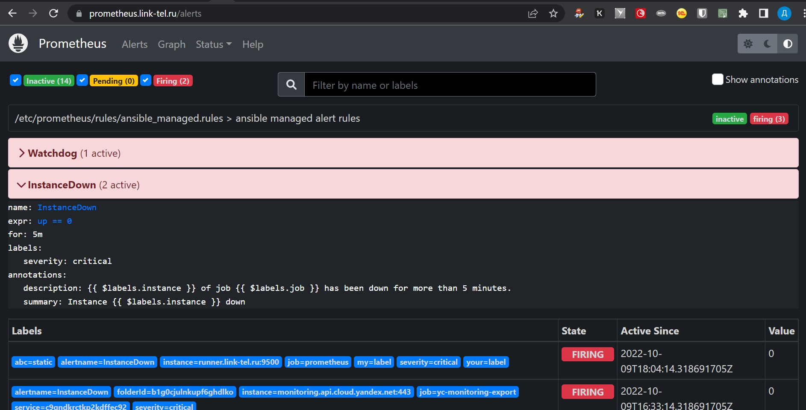

Видим покрасневшие Alert.

Дополнительно настроен Alerting на Telegram. Уточню, что возможность отправки Alertmanager'ом в данный сервис появилась лишь совсем недавно:

[https://github.com/prometheus/alertmanager/pull/2827](https://github.com/prometheus/alertmanager/pull/2827)

Так же это видно, что это самый свежий commit, и оны - 24/03/22:

[https://github.com/prometheus/alertmanager/releases/tag/v0.24.0](https://github.com/prometheus/alertmanager/releases/tag/v0.24.0)

Ниже принятое сообщение Alert в Telegram:

Видим, что все это дублируется в интерфейсе Altermanager:

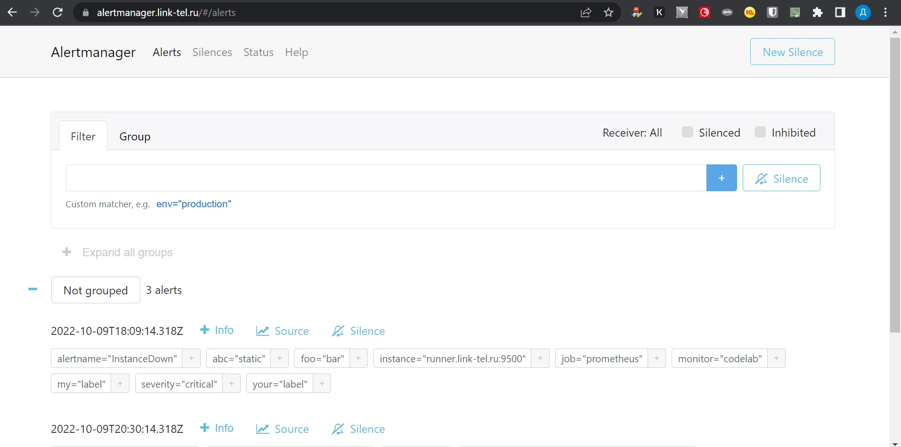

Собран тестовый дашбоард для Grafana:

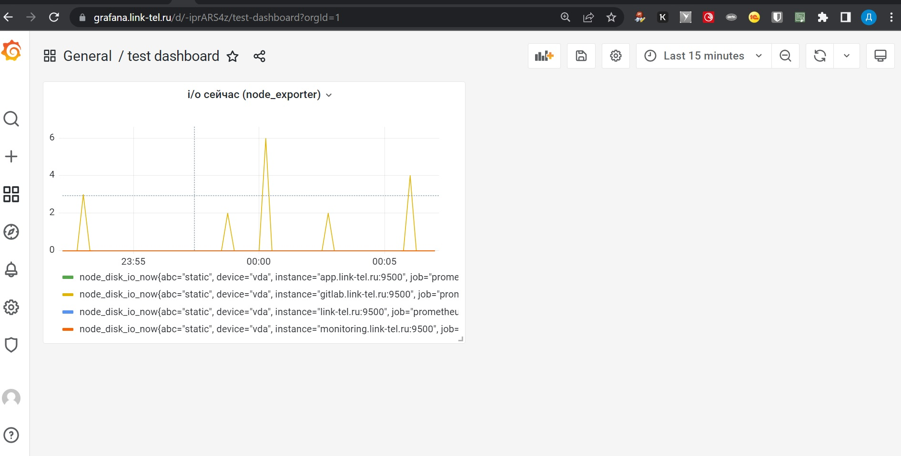

Наблюдался вполне боевой отказ виртуальной машины gitlab. Выглядело это так:

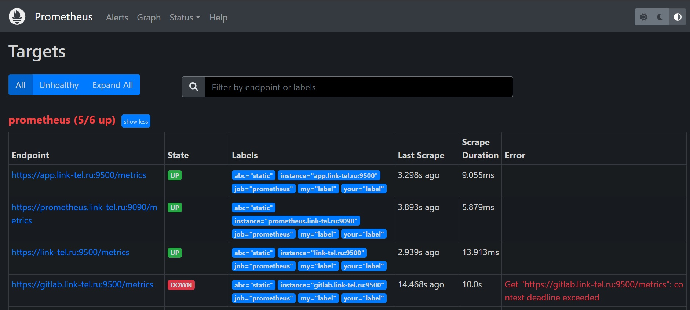

## Подробнее о pipe в gitlab.link-tel.ru...

Деплой и его валидация выглядит так:

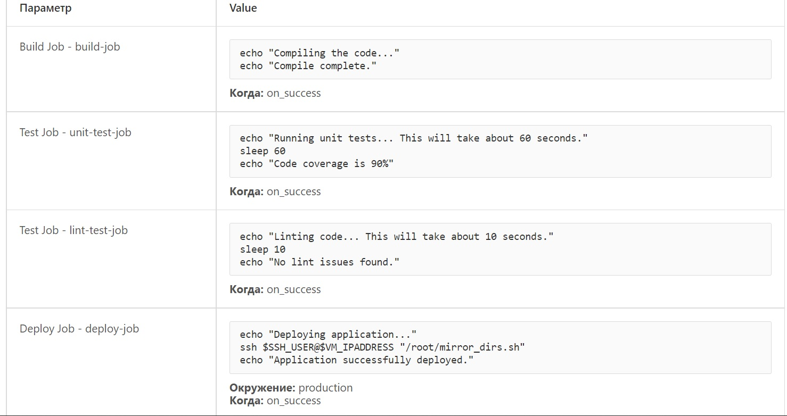

Сам pipline в визуализации:

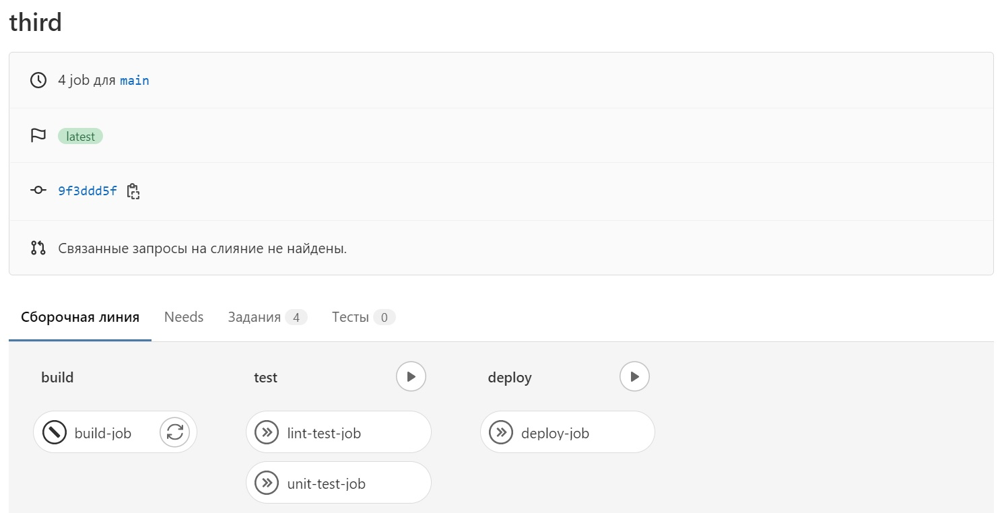

В нем мы видим несколько стадий, а именно:

1. Build-job
2. Link-test и Unit-test
3. Deploy job

Как раз на стадии 3 выполняется простеший bash-скрипт, который и выполняет сам процесс: используя rsync, синхронизирует рубочий репозитарий и prod, в момент появления commit.

Сам код прост, но не внем дело:

`
root@app:~/www# cat /root/mirror_dirs.sh 
#!/bin/bash

rsync  -rhzi --size-only --exclude 'tmp' /var/www/ /root/www/
 
`

Его цель, после коммита в основном репозитарии развернуть деплой в prod.

Интересно, что в нашем, самом простом задании, предварительные Build-job, Link-test/Unit-test - пока не имеют смысла и комментарии на них, автоматически меняют визуализацию:

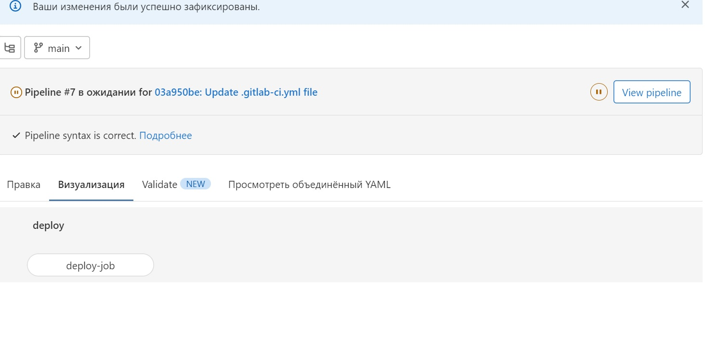

## Caveats

Особенно стоит отметить ошибку с 'Origin not allowed' в Grafana и ее поиском и лечением в конфиге:

`
        proxy_set_header Host $http_host;
`
Не получилось добиться от тех. поддержки YC, почему  не возвращают метрики от Managed MySQL, хотя с правами и запросом было вроде все хорошо:

`
curl -X GET -H "Authorization: Bearer $<Api key>" "https://monitoring.api.cloud.yandex.net/monitoring/v2/prometheusMetrics?folderId=b1g0cjulnkupf6ghdlko&service=c9qndkrctkp2kdffec92"

`
Поросили свои заголовки, но это видимо уже в следующий раз ...

## В заключении ...

В остальном, хотел бы поблагодарить всех преподавателей, инструкторов и наставников, за огромную, качественную работу ... Особенно интересен материал, который изложен и организован в очень удобном виде.